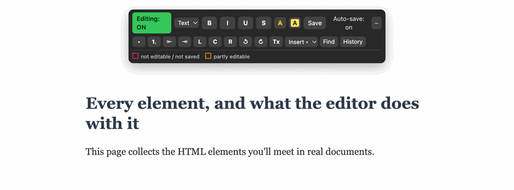

# htmdoc

**Open any HTML file on your computer and edit it like a
document.**



*Editing a page right in the browser — type anywhere, add a little formatting, and every change saves itself straight back to the file.*

Built for people who create and share static HTML with AI agents all the
time. Agents get you 95% of the way: a polished report, a dashboard, a
data story, but the last 5% is surgical. Round-
tripping through prompt for a two-word fix is slow and can
touch things you didn't ask it to. htmdoc is that missing last step: open
the html in the browser, and edit it like a Word document.

## Setup (once)

You need [Python](https://www.python.org/downloads/) — already on most Macs;
Windows users install it once (**tick "Add python.exe to PATH"**).

1. **Download**: green **Code** button above → **Download ZIP** → unzip.
2. **Start the helper** — easiest way, just double-click:
   - **Mac**: double-click **`htmdoc-mac.command`**.
   - **Windows**: double-click **`htmdoc-windows.bat`**.

   (The first time on a Mac you may need to right-click → **Open** to get past
   Gatekeeper.) Prefer the terminal? `python3 htmdoc.py` (Mac/Linux) or
   `python htmdoc.py` (Windows) does the same thing.

   **Leave the window it opens running** — the helper only works while it's up.
3. **Install the bookmark**: go to **http://127.0.0.1:8321/** and drag the
   blue **Make editable** button onto your bookmarks bar (⌘⇧B / Ctrl+Shift+B
   shows the bar).

To practice, try it on the included `demo.html` first.

## Editing a file (every day)

1. Helper running? (If not: Setup step 2 — ten seconds.)
2. **Double-click your HTML file.**
3. **Click the "Make editable" bookmark.** The editor toolbar appears.
4. **Type.** A second later the toolbar shows **`Saved ✓`** — it's in the
   file. No save button, nothing else to do.

The first save creates a backup next to your file (same name + `.bak`), in
case you ever want the original back.

## What to expect while editing

A small dark toolbar floats in the top-right corner:


- **Text ▾** turns the current line into a heading, quote, code block, or
  back to normal text. **B/I/U/S** bold/italicize/underline/strike the
  selection; the two color squares set text and highlight color.
- **Lists, indent (⇤ ⇥), alignment (L C R), undo/redo (↺ ↻)**, and **Tx**
  (clear formatting) work on the selection.
- **Insert ▾** drops in a new **link** (from the selected text, or fresh), a
  **table**, an **image** from your computer, or a **divider** at the cursor.
- **Pasting is cleaned up.** Text copied from Word, Google Docs, or a chat
  usually carries a mess of hidden styling; the editor keeps the words and the
  basic structure and drops the rest. Hold **Shift** while pasting for plain
  text.
- **Find** opens find & replace — change a word everywhere on the page at
  once.
- **History** lists the last saved versions of the file; one click restores
  any of them.
- **Click a link** to edit its text *and* its URL; **click an image** to
  replace it or edit its alt text; **+Row/−Row/+Col/−Col** appear
  automatically when your cursor is inside a table.

| Status | Meaning |
|---|---|
| `Auto-save: on` | The helper is running; your edits save themselves |
| `…` → `Saving…` → `Saved ✓` | You typed → it's being written → it's in the file |
| `Save failed` / `Server lost` | The save didn't happen — check the helper window is still open |
| `No save server` | The helper isn't running — do Setup step 2 again |

While editing, anything the tool can't (fully) edit is outlined right on the
page — hover an outlined element for the reason. A small legend row under
the toolbar recaps the colors (it only appears on pages that have such
elements):

| Outline | Meaning |
|---|---|
| **Red dashed** | Not editable / not saved: videos, audio, canvas drawings, embedded frames — and content created by the page's own programs (edits there may not stick) |
| **Amber dashed** | Partly editable: images (deletable, not redrawable) and form boxes (they stay, but typed values aren't saved) |

- Click into any heading, paragraph, list, or table cell and type.
- Clicking a link/button won't navigate away while you're editing. To actually follow a link, hold **Cmd** (Mac) or
  **Ctrl** (Windows) while clicking — it opens in a new tab, so your edits
  stay put. (Handily, that's the same shortcut browsers already use for
  opening a link in a tab without leaving the current page, so it likely
  matches your muscle memory.)
- Text labels inside charts and graphics (SVG images) can be edited too:
  click one, type in the little box that appears, press Enter.

## How saving works

- The first time a file is saved, a backup of the original is created next
  to it (same name, ending in `.bak`). It's made once and never touched
  again — delete it whenever you no longer want it.
- Saves are written safely: even if your computer crashes mid-save, the
  file can't end up half-written.
- Saved files contain only your page and your edits — no leftover pieces of
  this tool.
- Saving a page you *haven't* changed does nothing at all — the file isn't
  rewritten and no new version is recorded, so incidental saves don't pile up
  history or churn the file's timestamp.
- Beyond the one-time `.bak`, the helper keeps the **last 10 saved versions**
  of each file in a hidden `.htmdoc-history` folder next to it — the
  toolbar's **History** button restores any of them (and restoring itself
  makes a snapshot first, so you can't lose anything).

## If something isn't working

- **The toolbar says "No save server"** — the helper window isn't open.
  Start it again (Setup, step 2), then reload the page and click the
  bookmark again.
- **The bookmark does nothing** — check the helper window is open, then
  reload the page (⌘⇧R on Mac / Ctrl+Shift+R on Windows) and click it again.
- **`python3: command not found` (Mac)** — install Python once from
  [python.org/downloads](https://www.python.org/downloads/), then retry.
- **`python is not recognized` (Windows)** — reinstall Python and make sure
  to tick **"Add python.exe to PATH"** during the install.
- **An element has a red dashed outline** — the tool can't edit it (hover it
  for the reason); see "What it can't edit" below.
- **You want the original file back** — the file ending in `.bak` next to
  your file is the untouched original. Delete your edited file and remove
  `.bak` from the backup's name.

## Another way to open files: the file browser

The page at **http://127.0.0.1:8321/** also lists your folders and HTML
files. Click any file there and it opens ready to edit — no bookmark click
needed. Handy when you don't remember where a file lives.

## What it can't edit

This tool is for *documents*: pages made of text, images, tables, and
charts that sit still. Some pages are more like *apps* — they contain
programs (scripts) that build or change the page while you view it, for
example a chart that redraws when you move a slider. Editing those is
unreliable: the tool would save what the program drew, and the program
would draw it again on top the next time the page opens, doubling things
up. When you open a page like that through the file browser, the
script-created parts get a **red dashed outline** — take it as "edits here
may not stick."

A few other things that can't be changed in the page: what's *inside* an
image, drawings without text, and things you type into form boxes (the
boxes themselves stay, but typed-in values aren't part of the file).

<details><summary>Technical explanation</summary>

The editor saves the page by serializing the rendered DOM. On pages whose
scripts generate DOM (D3 charts, client-rendered widgets), that generated
content would be baked into the saved file and then regenerated on top of
it when reopened — duplicating or clobbering content. There is no general
way to know which DOM a script owns, so such pages are out of scope. Plain
`<script type="application/json">` data blocks are fine. Form control state
lives in JS properties, not attributes, so it doesn't serialize.
</details>

---

*Everything below is for technical readers — you don't need any of it to
use the tool.*

## Options

| Flag | Effect |
|---|---|
| `--root DIR` | Directory whose files can be edited (default: your home directory). Also the security boundary. |
| `--port N` | Port (default 8321). Everything adapts automatically. |
| `--token [VALUE]` | Require a secret token on every save. Bare `--token` auto-generates one; `--token VALUE` sets your own. The landing-page bookmarklet carries it automatically. Without this flag, writes are still gated by the Origin/Host checks below. |
| `--inject` | Permanently write the editor tag into HTML files directly in root, making them self-editable without even the bookmark click. |

## Security notes

The server binds `127.0.0.1` only, refuses paths outside `--root`, only
writes to existing `.html`/`.htm` files, writes atomically, and keeps a
one-time `.bak`. On top of that it defends against the two web attacks a
localhost helper is exposed to:

- **DNS rebinding** — it rejects any request whose `Host` header isn't
  `localhost`/`127.0.0.1`, so a remote site whose name resolves to your
  loopback address can't reach it.
- **Cross-site writes** — a save is accepted only from a page on this machine
  (a `file://` page, or one served by the helper itself). Another website you
  have open can't silently POST edits into your files: its request carries its
  own `Origin`, which is refused.

For a shared machine, or to close the residual case of a sandboxed
(null-origin) frame, run with **`--token`**: the helper prints a secret and
bakes it into the landing-page bookmarklet, and every save must present it.

Reads follow the same fence: the helper only returns a usable
`Access-Control-Allow-Origin` to local pages, so another site can't read your
files back either. Still, treat it as a convenience tool — run it while you're
editing, and narrow `--root` to the folder you actually work in.

## JS API

On any page with the editor loaded: `window.__htmdoc.enable() /
.disable() / .toggle() / .save()`, plus `.server` (resolved server address)
and `.serverOk` (whether auto-save is live).

## Try it

```sh
python3 htmdoc.py --root .     # from this repo's directory
# open http://127.0.0.1:8321/ and click demo.html — or double-click
# demo.html in Finder and use the bookmarklet
```

## Developing

Run the test suite (standard-library `unittest`, no dependencies):

```sh
python3 -m unittest -v test_htmdoc
```

It covers the parts that touch your disk: path-safety, the atomic
save / one-time-backup / rolling-history round-trip, and the Origin/Host/token
security guards. CI runs it on Linux, macOS, and Windows.

## License

MIT — see [LICENSE](LICENSE).
